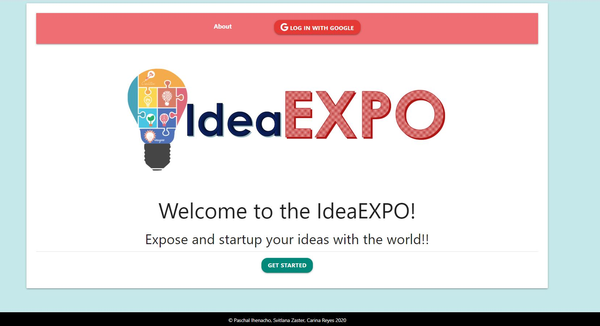
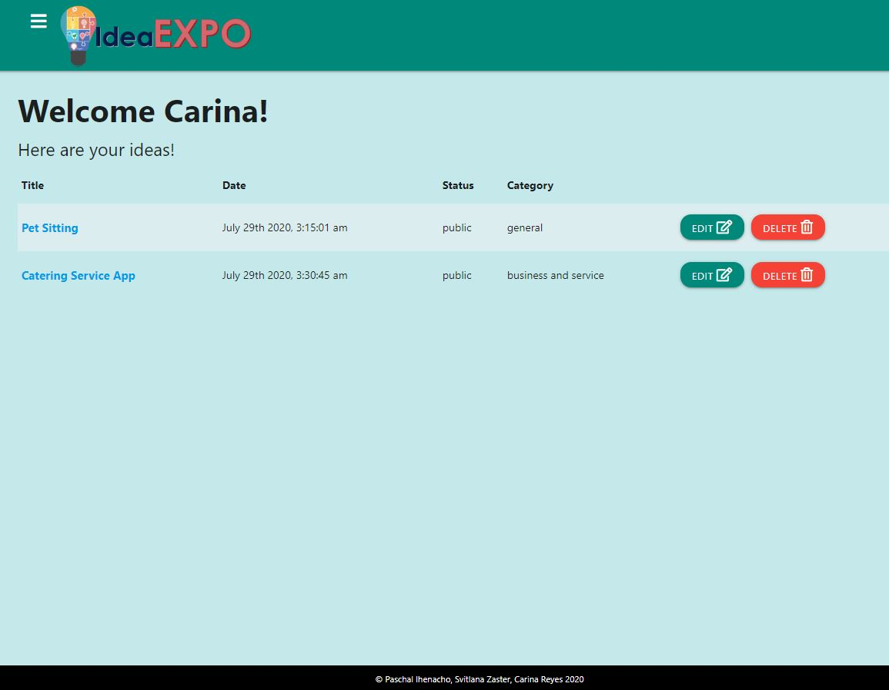
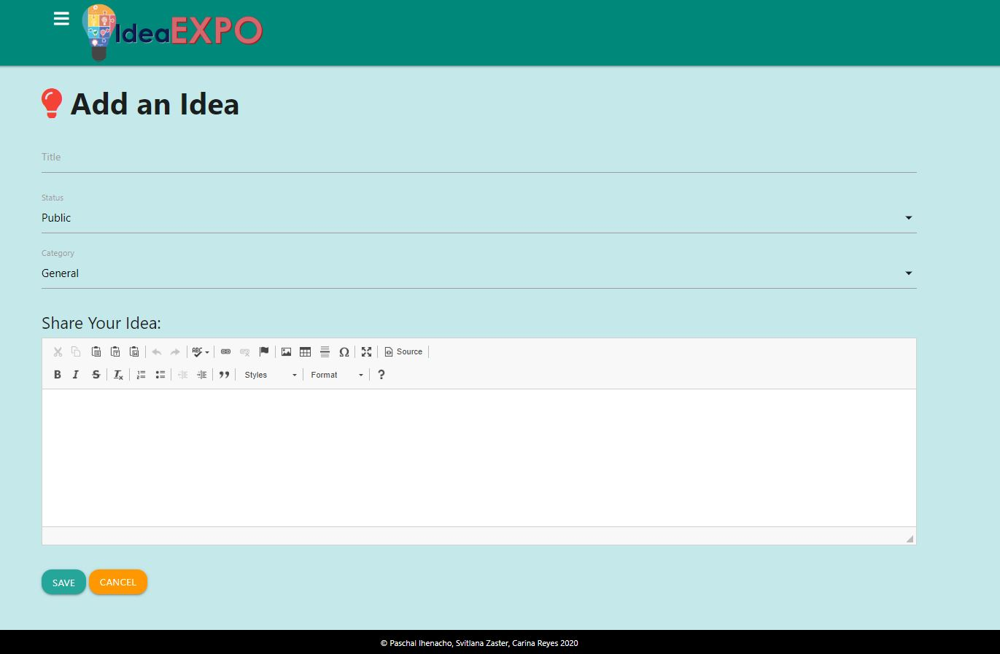
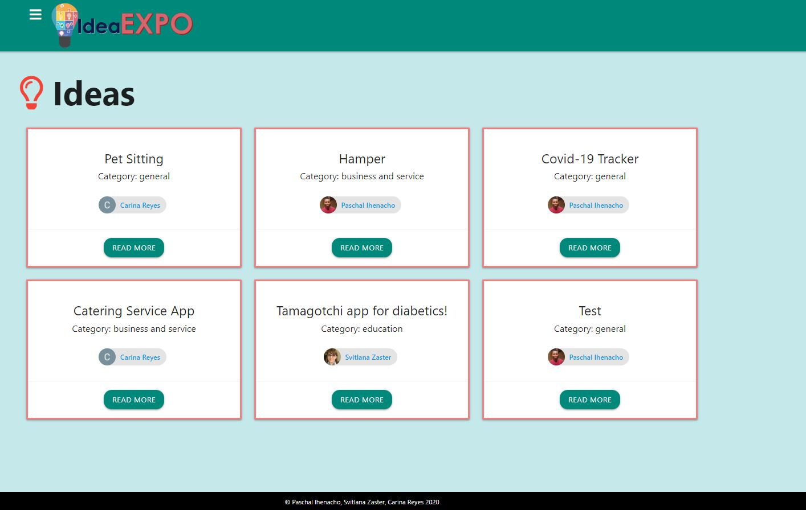

# IdeaEXPO

## Live Site:

[IdeaEXPO](http://ideaexpo.herokuapp.com)

## Description

As an investor you have a platform where you can choose a business idea from different bloggers all over the world. As a business partner/collaborator you may join in on an idea or add on by reaching out to the blogger. Our app will be a playground for developing and discussing business ideas.

The user will be able to post, edit, and read business ideas and have the choice to make them public or private. Future investors or collaborators will be able to view publics posts and will be able to contact the blogger if they are interested in the business idea or would like to add on to the idea.

As a web dev camp graduate who needs an additional coding experience and a brilliant portfolio, you can find a team willing to collaborate on the applications of your interest with other web dev graduates to sharpen your skills, gain experience and maybe, launch a startup!!!

## GIF/Image

## Table of Contents

- [IdeaEXPO](#ideaexpo)
  - [Live Site](#live-site)
  - [Description](#description)
  - [GIF/Image](#gifimage)
  - [Table of Contents](#table-of-contents)
  - [Installation](#installation)
  - [Tech Stack](#tech-stack)
  - [Usage](#usage)
  - [Collaborators](#collaborators)
  - [Future-Development](#future-development)
  - [Credits](#credits)
  - [License](#license)
  - [Tests](#tests)
  - [Questions](#questions)

## Installation

Clone the code on your machine and install and import all dependencies with npm install.

Run the application with a command npm start in a terminal.

## Tech Stack

Front-end framework [Materialzie](https://materializecss.com/) modern responsive front-end framework based on Material Design to quickly design and customize responsive sites.

Passport strategy [passport-google-oauth20](http://www.passportjs.org/packages/passport-google-oauth20/) for authenticating with Google using the OAuth 2.0 API. This module lets you authenticate using Google in your Node.js applications. By plugging into Passport, Google authentication can be easily and unobtrusively integrated into any application or framework that supports Connect-style middleware, including Express.

Sequelize is a promise-based Node.js ORM [Sequelize](https://www.npmjs.com/package/sequelize). It provides easy access to MySQL, MariaDB, SQLite or PostgreSQL databases by mapping database entries to objects and vice versa. It has very powerful migrations mechanism that can transform existing database schema into a new version. It also provides database synchronization mechanisms that can create database structure by specifying the model structure.

MySQL2 NPM package [MySQL2](https://www.npmjs.com/package/mysql2) to connect to MySQL database and perform queries.

Express web framework for node [Express](https://www.npmjs.com/package/express) to provide tooling for HTTP servers, making it a great solution for single page applications, web sites, hybrids, or public HTTP APIs.

Handlebars.js extension [Handlebars](https://www.npmjs.com/package/handlebars) templating language that keeps the view and the code separated.

Extension for VS code [Prettier - Code formatter](https://marketplace.visualstudio.com/items?itemName=esbenp.prettier-vscode) to autoformat the code when saving.

## Usage

Use the app deployed to Heroku, and/or clone the code on your machine and install and import dependencies with npm install.

Run the application with a command npm start in a terminal.

## Collaborators

- [Carina](https://github.com/Creyes17e)
- [Paschal](https://github.com/paschalihenacho)
- [Svitlana](https://github.com/szaster)

## Future-Development

Incirporate a communication between users by adding feedback such as "Discuss this idea".
Add emoji pictograms for idea validation.

## Credits

Activity: Sequelize-Passport Example; Burger Restaurant App, YouTube: Traversy Media; Ipenywis, Google Fu, Stack Overflow, Sequelize Documentation, W3Schools,DEV, Pixabay, TAs, Bootcamp Instructor.

## License

License: MIT

## Tests

No tests

## Questions

If you have any questions you can reach us by clicking below.

- [Carina](https://github.com/Creyes17e)
- [Paschal](https://github.com/paschalihenacho)
- [Svitlana](https://github.com/szaster)

You also can file an [issue](https://github.com/szaster/IdeaEXPO/issues) if you find a bug.
